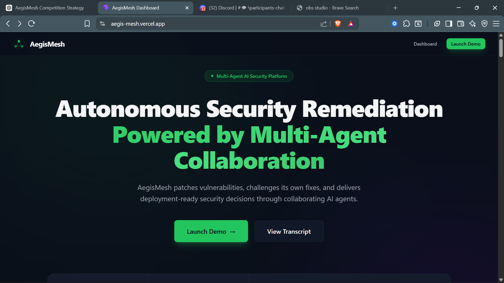
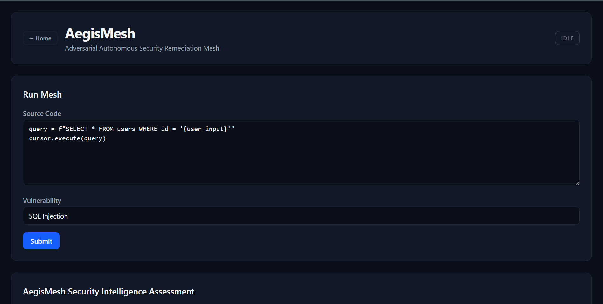
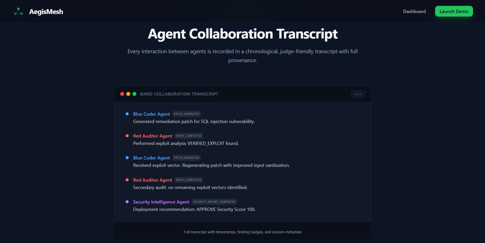

# AegisMesh — Autonomous Adversarial Security Remediation Mesh

[](https://www.python.org/)
[](https://react.dev/)
[](https://fastapi.tiangolo.com/)
[](https://tailwindcss.com/)
[](https://langchain-ai.github.io/langgraph/)
[](https://band.land)
[](tests/)
[](LICENSE)

**AegisMesh** is an autonomous adversarial security remediation mesh that generates patches, challenges them through independent red-team analysis, and produces deployment-ready security assessments — all coordinated in real-time over **BAND** live-collaboration channels.

A vulnerability enters the mesh. The **Blue Coder Agent** generates a patch. The **Red Auditor Agent** attempts to break it. The **Security Intelligence Agent** evaluates the result and produces an executive deployment decision. Every event is mirrored to a shared BAND chat room for human-in-the-loop observability.

---

## Problem Statement

Security teams face an impossible workload:

- **Vulnerability overload** — thousands of CVEs reported annually per organization
- **Manual remediation** — each patch requires developer time, code review, and security validation
- **Review bottlenecks** — security teams cannot scale linearly with vulnerability volume
- **Delayed deployments** — patches sit unreleased while awaiting sign-off

AegisMesh addresses all four problems autonomously, reducing a multi-day manual workflow to seconds.

---

## Solution

AegisMesh implements a full adversarial lifecycle in a single automated pipeline:

```
Vulnerability
    ↓
Generate Patch (Blue Coder Agent)
    ↓
Attack Patch (Red Auditor Agent)
    ↓
Assess Risk (Security Intelligence Agent)
    ↓
Deployment Decision
```

The architecture enforces **separation of powers**: each agent is independently specialized and cannot overrule the others. The Blue Agent generates fixes. The Red Agent validates them. The Security Intelligence Agent holds final deployment authority. This mirrors production security operations where developers, penetration testers, and security leads have distinct, non-overlapping responsibilities.

---

## Key Features

- **Three specialized AI agents** — Blue Coder (Qwen3-Coder-480B), Red Auditor (DeepSeek Chat), Security Intelligence (GPT-4o)
- **Adversarial feedback loop** — patches are generated, attacked, and regenerated until secure (up to 3 retries)
- **Graph-of-Thoughts auditing** — DAG-based adversarial reasoning explores multiple attack surfaces simultaneously
- **Evidence validation** — hallucinated evidence is detected and rejected; unfounded exploit claims are automatically downgraded
- **Context drift prevention** — original vulnerability is frozen on first triage; exploit chain is append-only
- **Event provenance** — every broadcast carries UUID, parent pointer, and ISO 8601 timestamp for full causal reconstruction
- **Audit recovery pipeline** — 4-stage fallback (direct parse → regex extraction → LLM repair → fallback critique) prevents mesh deadlocks from malformed LLM responses
- **BAND live-collaboration** — all mesh events mirrored to BAND chat rooms; room lifecycle is idempotent with self-mention filtering
- **Mock LLM mode** — zero-cost deterministic responses for development and testing; one env var to switch to live models
- **REST API** — FastAPI endpoints for running the mesh, checking health, and retrieving session transcripts
- **React dashboard** — dark-theme security operations console with real-time execution visualization
- **67 automated tests** — covering mesh reliability, event provenance, evidence validation, agent pipeline, and utility functions

---

## Multi-Agent Architecture

```
                     ┌──────────────────────────────────────────────────┐
                     │            BandMeshChannel                        │
                     │   (Pub/Sub Event Bus + Shared State)             │
                     │                                                  │
                     │   Events: VULNERABILITY_TRIAGED                  │
                     │           PATCH_PROPOSED                         │
                     │           AUDIT_COMPLETED                        │
                     │           SECURITY_REPORT_REQUESTED              │
                     │           SECURITY_REPORT_GENERATED              │
                     └──────┬─────────────────────┬─────────────────────┘
                            │                     │
              ┌─────────────▼──────────┐  ┌───────▼──────────────────┐
              │   Blue Coder Agent     │  │   Red Auditor Agent      │
              │  (Qwen3-Coder-480B)    │  │  (DeepSeek Chat)         │
              │                        │  │                          │
              │  LangGraph State-      │  │  Graph-of-Thoughts       │
              │  Machine:              │  │  Adversarial Audit:      │
              │  1. patcher_agent      │  │  Multiple attack vectors │
              │  2. compiler_validator  │  │  explored simultaneously │
              │  3. routing_evaluator  │  │  DAG reasoning tree      │
              └─────────────┬──────────┘  └───────┬──────────────────┘
                            │                     │
                            └──────────┬──────────┘
                                       │
                            ┌──────────▼──────────┐
                            │  Security            │
                            │  Intelligence Agent  │
                            │  (GPT-4o)            │
                            │                      │
                            │  Security scoring    │
                            │  Risk assessment     │
                            │  Executive summary   │
                            │  Deployment decision │
                            └──────────┬──────────┘
                                       │
                            ┌──────────▼──────────┐
                            │     FastAPI Layer    │
                            │   POST /api/run      │
                            │   GET  /api/health   │
                            └──────────┬──────────┘
                                       │
                            ┌──────────▼──────────┐
                            │   React Dashboard   │
                            │  (Vite + Tailwind)  │
                            └─────────────────────┘
```

### Agent Roles

| Agent | Model | Role |
|-------|-------|------|
| **Blue Coder Agent** | `alibaba/qwen3-coder-480b-a35b-instruct` | Generates code patches with Python compile verification, up to 3 retry iterations via LangGraph state machine |
| **Red Auditor Agent** | `deepseek/deepseek-chat` | Adversarially audits patches using Graph-of-Thoughts DAG reasoning; 4-stage JSON recovery pipeline prevents deadlocks |
| **Security Intelligence Agent** | `openai/gpt-4o` | Produces security score (0–100), confidence (0.0–1.0), risk level, executive summary, and deployment recommendation |

### Blue Coder State Machine

The Blue Coder uses a LangGraph `StateGraph` with three nodes:

1. **patcher_agent** — Calls the LLM with structured JSON schema output to generate a `PatchProposal`
2. **compiler_validator** — Runs `compile()` on the proposed code; reports SUCCESS or syntax error details
3. **routing_evaluator** — Returns `"retry"` if compilation failed and iterations remain, or `"finalize"` to end

Maximum 3 compile iterations per patch cycle. The compiled patch is always valid Python.

### Red Auditor Recovery Pipeline

| Stage | Method | Outcome |
|-------|--------|---------|
| 1 | Direct `model_validate_json()` | Fast path for well-formed LLM responses |
| 2 | Regex-based largest-JSON extraction | Recovers valid JSON from markdown-wrapped output |
| 3 | LLM-based JSON repair | Sends raw text with a repair system prompt for reformatting |
| 4 | Fallback `INFORMATIONAL` critique | Never blocks convergence; increments `audit_degradations` counter |

### Evidence Validation

Every audit finding is grounded against the original source code before it enters the mesh:

- File paths must match the submitted source file
- Line numbers must be within bounds (1 to total line count)
- Invalid evidence is removed from the critique
- A `VERIFIED_EXPLOIT` that loses all evidence is automatically downgraded to `SPECULATIVE_RISK`

This prevents LLM hallucination of exploit evidence from driving unnecessary patch iterations.

---

## BAND-Powered Coordination

AegisMesh uses **BAND** as its live-collaboration layer for multi-agent coordination, task handoffs, and execution traceability.

### How BAND Enables the Mesh

| Capability | Implementation |
|------------|----------------|
| **Agent Communication** | All 3 agents are registered as BAND participants with unique agent IDs, API keys, and handles (`@codemechie/bluecoderagent`, `@codemechie/redauditoragent`, `@codemechie/securityintelligenceagent`) |
| **Task Handoffs** | Sequential handoff chain: Blue Coder → `PATCH_PROPOSED` → Red Auditor → `AUDIT_COMPLETED` → Security Intelligence → `SECURITY_REPORT_GENERATED` |
| **Shared Context** | `BandMeshChannel` pub/sub event bus coordinates all agents within a single BAND room per session |
| **Task State** | 5 event types (`VULNERABILITY_TRIAGED`, `PATCH_PROPOSED`, `AUDIT_COMPLETED`, `SECURITY_REPORT_REQUESTED`, `SECURITY_REPORT_GENERATED`) track state transitions |
| **Transcript Generation** | Every broadcast and terminal status is mirrored to the BAND room as a human-readable message with emoji prefixes and @mentions |
| **Multi-Agent Orchestration** | `BandEventMirror` subscribes to all mesh events and mirrors 6 event types (4 broadcasts + 2 terminal statuses) with payload summaries (<250 bytes each) |

### Event Mirror Mapping

| Event | Emoji | Mentions |
|-------|-------|----------|
| `VULNERABILITY_TRIAGED` | 🔍 | (none — mentions filtered) |
| `PATCH_PROPOSED` | 🔧 | Red Auditor agent |
| `AUDIT_COMPLETED` | 🔬 | Security Intelligence agent |
| `SECURITY_REPORT_GENERATED` | 📋 | Blue Coder agent |
| `SECURED` (terminal) | ✅ | (none) |
| `ESCALATION_REQUIRED` (terminal) | ⚠️ | (none) |

### BAND Infrastructure

- **Room lifecycle**: `BandRoomManager` ensures idempotent room creation — same `session_id` returns cached room
- **Self-mention filter**: Agents cannot @mention themselves; empty-mentions fallback mentions all other participants (BAND API requires `minItems: 1`)
- **Failure isolation**: Mirror failures are recorded in `system_logs` and `band_telemetry` but never crash the mesh
- **Connectivity verified**: 3 standalone test scripts validate auth, messaging, and 3-agent handoff flows

---

## AI/ML Intelligence Layer

### Model Selection

Models are centrally configured in `core/model_config.py` with environment variable overrides:

| Variable | Default | Agent |
|----------|---------|-------|
| `BLUE_MODEL` | `alibaba/qwen3-coder-480b-a35b-instruct` | Blue Coder Agent |
| `RED_MODEL` | `deepseek/deepseek-chat` | Red Auditor Agent |
| `SECURITY_INTELLIGENCE_MODEL` | `openai/gpt-4o` | Security Intelligence Agent |

The production configuration (`qwen3-coder + deepseek-chat + gpt-4o`) was selected through systematic benchmarking (`scripts/model_benchmark.py`) across 9 combinations of 3 models × 3 vulnerability types.

### Mock Mode

By default, AegisMesh runs in **mock mode** (no API key required):

- `MockCompletions.create()` returns deterministic, realistic responses for all three agents
- Blue Coder mock generates a parameterized query patch
- Red Auditor mock returns `VERIFIED_EXPLOIT` on first audit, `INFORMATIONAL` on re-evaluation
- Security Intelligence mock returns scored reports with configurable severity
- Each mock response prints `[MOCK CLIENT] Intercepted call for model '{model}'` to console

Set `USE_REAL_AI_ML_API=TRUE` and provide `AI_ML_API_KEY` to route through live models via `https://api.aimlapi.com/v1`.

### Live API Costs

Estimated cost per mesh run at production scale:

| Component | Token Range | Cost |
|-----------|-------------|------|
| Blue Coder (per iteration) | ~250–400 tokens | ~$0.002 |
| Red Auditor (per audit) | ~350–400 tokens | ~$0.001 |
| Security Intelligence | ~500–700 tokens | ~$0.003 |
| **Full mesh run (1 iteration)** | ~1,100–1,500 tokens | **~$0.006** |
| **Max depth run (8 iterations)** | ~4,000–8,000 tokens | **~$0.048** |

Blue Coder dominates ~85% of costs due to the 480B parameter model.

---

## Security Workflow

### Adversarial Loop

```
VULNERABILITY_TRIAGED
    ↓
Blue Coder Agent (LangGraph: patch → compile → route)
    ↓  PATCH_PROPOSED
Red Auditor Agent (GoT adversarial audit + evidence validation)
    ↓
  ┌── VERIFIED_EXPLOIT → exploit chain appended → retry (up to 3)
  ├── SPECULATIVE_RISK  → recorded, loop ends
  └── INFORMATIONAL     → recorded, loop ends
    ↓
SECURITY_REPORT_REQUESTED (auto-emitted on convergence)
    ↓
Security Intelligence Agent (score, risk, recommendation)
    ↓
SECURITY_REPORT_GENERATED
```

Only `VERIFIED_EXPLOIT` continues the remediation loop. `SPECULATIVE_RISK` and `INFORMATIONAL` findings are recorded but do not trigger a new patch cycle, preventing infinite loops on non-deterministic findings.

### Finding Classification

| Classification | Meaning | Effect |
|---------------|---------|--------|
| **VERIFIED_EXPLOIT** | Demonstrable exploit found in the submitted code | Patch rejected, remediation loop continues |
| **SPECULATIVE_RISK** | Plausible attack vector, not demonstrable | Recorded, loop ends |
| **INFORMATIONAL** | Non-blocking recommendation or observation | Recorded, loop ends |

A `VERIFIED_EXPLOIT` without valid evidence is automatically downgraded to `SPECULATIVE_RISK` by the evidence validation pipeline.

### Security Intelligence Output

| Output | Description |
|--------|-------------|
| **Security Score** | 0–100 quantitative security posture score |
| **Confidence** | 0.0–1.0 confidence in the assessment |
| **Risk Level** | CRITICAL, HIGH, MEDIUM, or LOW |
| **Deployment Recommendation** | APPROVE, APPROVE_WITH_MONITORING, ESCALATE_REVIEW, or BLOCK |
| **Executive Summary** | Narrative summary for non-technical stakeholders |
| **Reasoning** | List of reasoning steps behind the assessment |
| **Remaining Risks** | Outstanding security concerns not remediated |

The Security Intelligence Agent is the only agent with authority to issue deployment recommendations. The Blue Agent generates fixes. The Red Agent validates them. The Security Intelligence Agent decides.

---

## Explainability & Auditability

Every mesh execution produces a complete, inspectable record:

| Artifact | Description |
|----------|-------------|
| **Event History** | Every broadcast recorded with UUID, parent event pointer, ISO 8601 timestamp, and full payload |
| **Audit History** | All audit iterations preserved with GoT reasoning trees and evidence lists |
| **Exploit Chain** | Append-only list of exploit vectors discovered during the adversarial loop |
| **Original Vulnerability** | Frozen on first triage — never mutated by iterations |
| **Agent Failures** | Isolated listener errors recorded with timestamp, type, and recovery status |
| **Benchmark Telemetry** | Iteration count, finding type counts, audit degradations, evidence validation stats |
| **BAND Transcript** | Full event stream mirrored to BAND chat room with human-readable messages |
| **REST API** | `GET /api/transcript/:sessionId` returns full `MeshContext` for external consumption |

---

## Technology Stack

### Backend
- **Python 3.10+** — Runtime
- **FastAPI** — REST API layer with CORS middleware
- **LangGraph** — Blue Coder state machine (compile-verified patch generation)
- **Pydantic** — Schema validation with JSON Schema structured output
- **Uvicorn** — ASGI server
- **BAND SDK** — Multi-agent live-collaboration integration
- **OpenAI SDK** — LLM client for real API mode (OpenRouter-compatible)

### Frontend
- **React 19** — UI framework
- **TypeScript 6** — Type safety
- **Vite 8** — Build tool
- **Tailwind CSS v4** — Styling with custom dark-theme design tokens
- **TanStack Query 5** — Server state management
- **React Router 7** — Client-side routing (6 pages)
- **Lucide React** — Icon library
- **class-variance-authority** + **tailwind-merge** — Component styling utilities

### Infrastructure
- **Render** — Backend container (FastAPI + uvicorn)
- **Vercel** — Frontend SPA with rewrite rules for client-side routing
- **BAND** — Real-time multi-agent coordination layer

---

## Deployment Architecture

```
┌─────────────┐     ┌──────────────┐     ┌──────────────┐
│   Browser   │────▶│   Vercel     │────▶│   Render      │
│  (SPA)      │     │  (Frontend)  │     │  (Backend)    │
│             │     │  React 19    │     │  FastAPI      │
│             │     │  Vite build  │     │  uvicorn      │
└─────────────┘     └──────────────┘     └──────┬───────┘
                                                 │
                                        ┌────────▼───────┐
                                        │  AI/ML API     │
                                        │  (OpenRouter)  │
                                        └────────────────┘
                                                 │
                                        ┌────────▼───────┐
                                        │   BAND         │
                                        │  (Chat Rooms)  │
                                        └────────────────┘
```

- **Backend URL**: `https://aegismesh.onrender.com`
- **Frontend URL**: Served via Vercel with `VITE_API_URL=https://aegismesh.onrender.com`
- **CORS**: Backend uses wildcard `allow_origins=["*"]` for Vercel origin compatibility
- **Cold start**: Render free tier auto-sleeps after 15 min idle; cold start ~30–60s

---

## Getting Started

### Prerequisites

```bash
python >= 3.10
node >= 20
```

### Backend

```bash
git clone https://github.com/yourusername/aegismesh.git
cd aegismesh
python -m venv .venv
.venv\Scripts\activate  # Windows
# source .venv/bin/activate  # macOS/Linux
pip install -r requirements.txt
python api.py
```

### Frontend

```bash
cd frontend
npm install
npm run dev
```

Open `http://localhost:5173` in your browser.

### Production Build

```bash
cd frontend
npm run build
npm run preview
```

### CLI Mode

```bash
python main.py
```

Seeds a mock SQL injection vulnerability and runs the full adversarial lifecycle directly in the terminal. BAND event mirroring is automatically initialized.

### Live LLM Mode

```bash
USE_REAL_AI_ML_API=TRUE AI_ML_API_KEY=your_key_here python main.py
```

### Tests

```bash
python -m pytest tests/ -v
```

67 tests across 4 test files:

| File | Tests | Coverage |
|------|-------|----------|
| `test_agents.py` | 9 | Blue Coder LangGraph: compile validation, routing, patch generation |
| `test_band_mesh.py` | 36 | Mesh reliability: iteration counting, escalation guard, callback isolation, event provenance, context drift prevention |
| `test_evidence_validation.py` | 20 | Evidence validation: line number bounds, file path matching, mixed validity, downgrade rules |
| `test_utils.py` | 2 | Markdown code extraction utilities |

### BAND Smoke Tests

```bash
python scripts/band_connectivity_test.py
python scripts/band_message_smoke_test.py
python scripts/band_multi_agent_handoff_test.py
```

---

## Usage

### REST API

```bash
curl -X POST http://localhost:8000/api/run \
  -H "Content-Type: application/json" \
  -d '{
    "source_code": "query = f\"SELECT * FROM users WHERE id = {user_input}\"",
    "vulnerability": "SQL Injection"
  }'
```

Returns the full `MeshContext` — event history, exploit chain, audit history, patch, security report, and telemetry including `band_room_id`, `band_room_url`, and `band_telemetry`.

### API Endpoints

| Method | Endpoint | Description |
|--------|----------|-------------|
| `GET` | `/api/health` | Service health check returns `{status, service, version}` |
| `POST` | `/api/run` | Execute full mesh run; returns `MeshContext` |
| `GET` | `/api/transcript/:sessionId` | Retrieve full `MeshContext` for a prior session (planned) |

### Frontend Pages

| Route | Page | Description |
|-------|------|-------------|
| `/` | Landing Page | Marketing/sales landing with hero, problem, workflow, tech stack, benchmarks, CTA |
| `/dashboard` | Dashboard | Interactive mesh runner: input source code + vulnerability, view full results |
| `/transcript/:sessionId` | Transcript Viewer | BAND collaboration transcript with agent-styled event cards |
| `/benchmarks` | Benchmarks | Benchmark results for SQL Injection, Command Injection, Path Traversal |
| `/documentation` | Documentation | Full technical documentation with sidebar navigation |
| `/api-reference` | API Reference | REST API reference with request/response examples and architecture diagram |

---

## Environment Variables

### AI/ML API

| Variable | Required | Default | Description |
|----------|----------|---------|-------------|
| `USE_REAL_AI_ML_API` | No | `FALSE` | Set to `TRUE` to enable live LLM calls |
| `AI_ML_API_KEY` | Conditional | — | API key for AI/ML API (required when `USE_REAL_AI_ML_API=TRUE`) |
| `AI_ML_API_BASE_URL` | No | `https://api.aimlapi.com/v1` | Base URL for LLM API |

### Model Selection

| Variable | Required | Default | Description |
|----------|----------|---------|-------------|
| `BLUE_MODEL` | No | `alibaba/qwen3-coder-480b-a35b-instruct` | Blue Coder Agent model |
| `RED_MODEL` | No | `deepseek/deepseek-chat` | Red Auditor Agent model |
| `SECURITY_INTELLIGENCE_MODEL` | No | `openai/gpt-4o` | Security Intelligence Agent model |

### BAND Integration

| Variable | Required | Default | Description |
|----------|----------|---------|-------------|
| `BLUE_AGENT_ID` | Yes | — | Blue Coder BAND agent UUID |
| `BLUE_AGENT_API_KEY` | Yes | — | Blue Coder BAND API key |
| `BLUE_AGENT_HANDLE` | No | `@codemechie/bluecoderagent` | Blue Coder BAND handle |
| `RED_AGENT_ID` | Yes | — | Red Auditor BAND agent UUID |
| `RED_AGENT_API_KEY` | Yes | — | Red Auditor BAND API key |
| `RED_AGENT_HANDLE` | No | `@codemechie/redauditoragent` | Red Auditor BAND handle |
| `SECURITY_INTELLIGENCE_AGENT_ID` | Yes | — | Security Intelligence BAND agent UUID |
| `SECURITY_INTELLIGENCE_API_KEY` | Yes | — | Security Intelligence BAND API key |
| `SECURITY_INTELLIGENCE_HANDLE` | No | `@codemechie/securityintelligenceagent` | Security Intelligence BAND handle |

### Frontend

| Variable | Required | Default | Description |
|----------|----------|---------|-------------|
| `VITE_API_URL` | No | `http://localhost:8000` | Backend API base URL (set to `https://aegismesh.onrender.com` in production) |

---

## Project Structure

```
aegismesh/
├── core/
│   ├── band_mesh.py              # Pub/sub event bus + shared state + provenance
│   ├── aiml_client.py            # LLM client (mock/real switching)
│   ├── model_config.py           # Centralized model configuration
│   ├── security_intelligence.py  # Context preparation helper for SI agent
│   └── utils.py                  # Markdown code extraction utility
├── agents/
│   ├── blue_coder/
│   │   ├── agent.py              # LangGraph StateGraph definition
│   │   └── graph.py              # BlueCoderState TypedDict
│   ├── red_auditor/
│   │   ├── engine.py             # GoT adversarial audit + 4-stage recovery
│   │   └── prompts.py            # System prompt for DeepSeek Chat
│   └── security_intelligence/
│       ├── agent.py              # Security report generation
│       └── prompts.py            # Security Intelligence system prompt
├── schemas/
│   ├── __init__.py               # Re-exports core models
│   ├── models.py                 # Pydantic models (FileContext, VulnerabilityReport, PatchProposal, ThoughtNode, Evidence, AuditCritique)
│   ├── security_report.py        # SecurityIntelligenceReport model
│   └── telemetry.py              # BenchmarkTelemetry, BandTelemetry models
├── integrations/
│   └── band/
│       ├── __init__.py           # setup_band_mirror() factory
│       ├── band_client.py        # BAND REST API wrapper with self-mention filter
│       ├── band_room_manager.py  # Idempotent room/participant lifecycle
│       └── band_event_mirror.py  # Mirror callbacks + payload summarization
├── frontend/
│   ├── src/
│   │   ├── api/aegismesh.ts      # Typed fetch wrapper (checkHealth, runMesh)
│   │   ├── types/mesh.ts         # TypeScript MeshContext types
│   │   ├── pages/                # 6 pages (Landing, Dashboard, Transcript, Benchmarks, Documentation, API Reference)
│   │   ├── components/           # Dashboard panels (12), shared (11), landing (12), UI (5), transcript (2)
│   │   ├── graph/                # AgentMeshFlow execution visualization
│   │   ├── context/              # MeshDataContext (session state across navigation)
│   │   ├── data/                 # Static landing + benchmark data
│   │   ├── utils/                # finding, model, transcript, time utilities
│   │   └── hooks/                # useReveal IntersectionObserver hook
│   ├── package.json
│   ├── vite.config.ts
│   └── vercel.json               # SPA rewrite rule
├── scripts/
│   ├── band_connectivity_test.py      # BAND auth + WebSocket stability
│   ├── band_message_smoke_test.py     # Room creation + messaging
│   ├── band_multi_agent_handoff_test.py # 3-agent handoff chain
│   └── model_benchmark.py             # Benchmark runner (3 models × 3 vulns)
├── tests/
│   ├── conftest.py               # Shared pytest fixtures
│   ├── test_agents.py            # 8 Blue Coder graph tests
│   ├── test_band_mesh.py         # 36 mesh reliability + provenance tests
│   ├── test_evidence_validation.py # 20 evidence validation tests
│   └── test_utils.py             # 2 utility tests
├── api.py                        # FastAPI server (health, run endpoints)
├── main.py                       # CLI entry point / orchestration wiring
└── requirements.txt
```

---

## Benchmark Results

### SQL Injection

```
Source:     query = f"SELECT * FROM users WHERE id = {user_input}"
Status:     SECURED
Score:      95/100
Risk:       LOW
Recommend:  APPROVE
Runtime:    18.2s
Iterations: 1
```

### Command Injection

```
Source:     import os; os.system(f"ping {user_input}")
Status:     SECURED
Score:      98/100
Risk:       LOW
Recommend:  APPROVE
Runtime:    14.1s
Iterations: 1
```

### Path Traversal

```
Source:     open(f"/var/data/{filename}", "r")
Status:     SECURED
Score:      92/100
Risk:       LOW
Recommend:  APPROVE_WITH_MONITORING
Runtime:    46.2s
Iterations: 1
```

### Telemetry

| Metric | SQL Injection | Command Injection | Path Traversal |
|--------|---------------|-------------------|----------------|
| Mesh Iterations | 1 | 1 | 1 |
| Verified Exploits | 0 | 0 | 0 |
| Speculative Risks | 1 | 0 | 1 |
| Informational | 0 | 1 | 0 |
| Audit Degradations | 0 | 0 | 0 |

---

## Dashboard Panels

The React dashboard presents mesh execution results in a narrative flow:

```
Security Intelligence Hero Panel
  ↓  Executive assessment, score, recommendation, BAND transcript link
Patch Viewer
  ↓  Generated code patch with Blue Agent model badge
Event Timeline + Exploit Chain
  ↓  Color-coded event stream + remediation story
Security Convergence + Mesh Health
  ↓  Iteration progression + system metrics
Agent Failures
  ↓  Failure telemetry (or green "all clear")
Agent Mesh Execution Flow
  ↓  Full pipeline visualization with model attribution
```

### Key Panels

| Panel | Description |
|-------|-------------|
| **Security Intelligence Hero** | Decision banner, agent workflow snapshot, security score, executive summary, confidence/risk/recommendation KPIs, findings summary, agent models, reasoning accordion, remaining risks, BAND collaboration link |
| **Remediation Story** | Narrative 5-step flow: Vulnerability → Blue Agent → Red Agent → Security Intelligence → Final Status |
| **Agent Mesh Execution Flow** | Vertical pipeline visualization showing each agent's action, model, findings, and the deployment decision |
| **Patch Viewer** | Generated patch in dark code block with Blue Agent model badge |
| **Event Timeline** | Reverse-chronological event stream with color-coded audit finding badges |
| **Finding Details Modal** | Full-screen drill-down into audit findings with evidence, GoT reasoning, keyboard navigation |
| **Transcript Viewer** | BAND collaboration transcript with agent-styled event cards |

---

## Design Decisions

| Decision | Rationale |
|----------|-----------|
| **Three-agent architecture** | Separation of powers: patch generation, adversarial validation, and deployment assessment are independent, mirroring production security operations |
| **Adversarial feedback loop** | Each rejection includes the exploit vector, making subsequent patches strictly better; only VERIFIED_EXPLOIT continues the loop |
| **In-process event bus** | Avoids distributed-system complexity; shared dict is synchronously mutated for full determinism |
| **Security Intelligence as final authority** | Prevents the patch generator from approving its own output; deployment decisions come from an independent assessor |
| **Graph-of-Thoughts auditing** | DAG-based reasoning forces exploration of multiple attack surfaces simultaneously |
| **Audit recovery pipeline** | 4-stage fallback prevents mesh deadlocks from malformed LLM responses |
| **Evidence validation** | Prevents hallucinated exploit evidence from driving unnecessary iteration cycles |
| **Mock mode by default** | Zero API cost during development; one env var to switch to live models |
| **Event provenance (UUID + parent pointer)** | Enables full causal graph reconstruction without external storage |
| **Callback isolation with telemetry** | One failing agent never crashes the mesh; errors are recorded for debugging |
| **BAND live-collaboration mirroring** | Every mesh event is mirrored to a shared chat room for human-in-the-loop observability |
| **Dark-first React UI** | Security operations console aesthetic using Tailwind v4 custom design tokens |
| **Dual UI (CLI + REST + Dashboard)** | Supports local development, API integration, and visual exploration |

---

## Screenshots


*Landing page — marketing hero with problem, workflow, and tech stack sections.*


*Interactive dashboard — mesh execution results with Security Intelligence report, patch viewer, event timeline, and execution flow.*


*BAND collaboration transcript — agent-styled event cards with finding badges and timestamps.*

---

## Future Work

- **Persistent session storage** — Store `MeshContext` by `session_id` for transcript retrieval across restarts
- **User authentication** — API key-based access control for the REST API
- **Additional vulnerability types** — XSS, CSRF, SSRF, deserialization, and dependency-specific CVEs
- **Multi-language support** — Extend Blue Coder compiler validation beyond Python (JavaScript, Java, Go)
- **Custom agent definitions** — User-configurable agent models and prompts via the dashboard
- **Scheduled scanning** — Cron-based vulnerability monitoring with automated mesh execution
- **Slack/Teams integration** — Additional notification channels beyond BAND
- **Benchmark persistence** — Store and compare benchmark results over time

---

## License

MIT

---

## Hackathon Highlights

### Multi-Agent Collaboration

Three specialized AI agents (Blue Coder, Red Auditor, Security Intelligence) coordinate over a shared event bus to autonomously patch security vulnerabilities. Each agent is independently specialized and cannot overrule the others — the architecture enforces separation of powers that mirrors production security operations.

### BAND Integration

Every mesh event is mirrored in real-time to a BAND chat room. The integration includes idempotent room lifecycle management, self-mention filtering (BAND API `minItems: 1` compliance), payload summarization (<250 bytes per message), and 6 event types mapped to human-readable messages with emoji prefixes and @mentions. Three standalone test scripts validate connectivity, messaging, and multi-agent handoff flows.

### Adversarial Security Validation

The Red Auditor Agent uses Graph-of-Thoughts DAG reasoning to explore multiple attack surfaces simultaneously. Evidence grounding validates every exploit claim against the actual source code — hallucinated evidence is automatically rejected and unfounded `VERIFIED_EXPLOIT` findings are downgraded. A 4-stage JSON recovery pipeline prevents mesh deadlocks from malformed LLM responses.

### Explainable AI Reasoning

Every mesh execution produces a complete audit trail: event history with UUID provenance, append-only exploit chain, frozen original vulnerability, GoT reasoning trees for every audit, and a structured Security Intelligence Report with scoring, risk assessment, and deployment recommendation. All data is available via REST API and rendered in the React dashboard.

### Security Intelligence Reporting

The Security Intelligence Agent evaluates the full execution context and produces a 0–100 security score, confidence metric, risk level (CRITICAL/HIGH/MEDIUM/LOW), deployment recommendation (APPROVE/APPROVE_WITH_MONITORING/ESCALATE_REVIEW/BLOCK), executive summary, reasoning chain, and remaining risks. This is the final authority — the Blue Agent cannot approve its own patches.

### Cloud Deployment

The system is fully deployed on production infrastructure: FastAPI backend on Render with uvicorn, React frontend on Vercel with SPA rewrite rules, environment-driven API URL configuration (`VITE_API_URL`), and wildcard CORS for cross-origin requests. Cold starts on the Render free tier take ~30–60s after idle periods.
